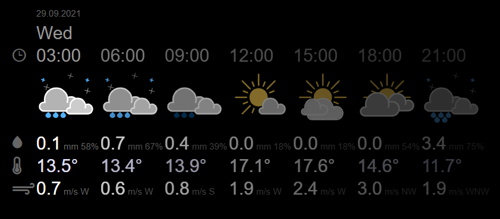
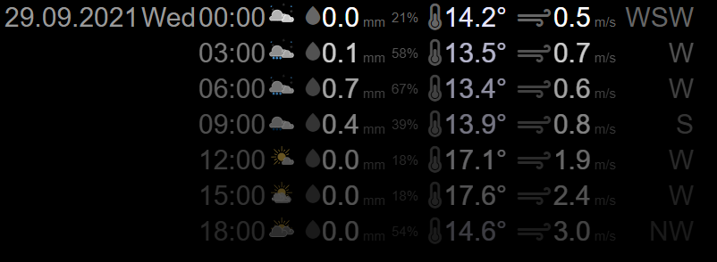
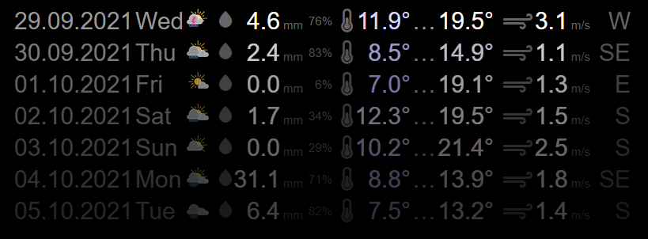
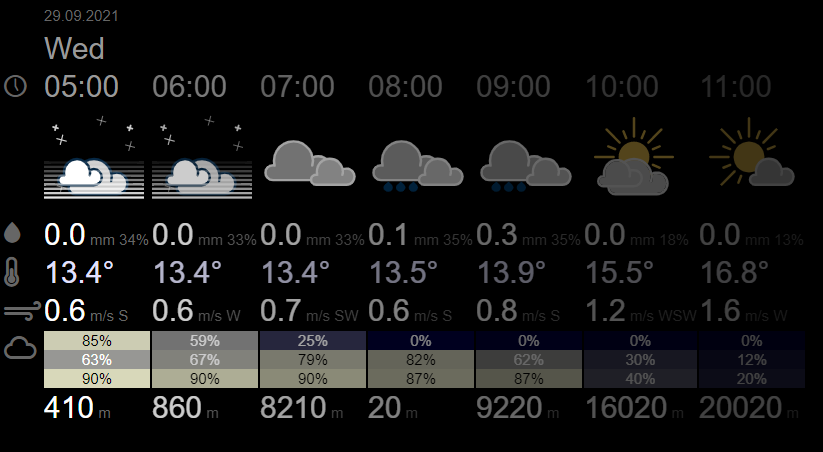
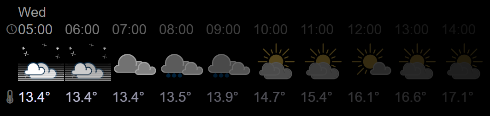

# MMM-weather-meteoblue-astronomy

Magic Mirror Module Weather forecast for astronomy - data from meteoblue


## Installation

```shell
# go to the MagicMirror installation
cd MagicMirror

# go to the modules directory
cd modules

# clone the git repository
git clone https://github.com/eobermuhlner/MMM-weather-meteoblue-astronomy.git
```

## Configuration

Get an API Key from meteoblue: https://www.meteoblue.com/en/weather-api

Edit the `MagicMirror/config/config.js` file:
```json5
	modules: [
    {
      module: "MMM-weather-meteoblue-astronomy",
      position: "top_right",
      config: {
        lat: 47.22557,
        lon: 8.82228,
        asl: 424, // optional - elevation above sea level
        tz: "Europe%2FZurich",
        apikey: "TEST", // replace this with your APIKEY
        package: "basic-3h",
        layout: "horizontal" // vertical or horizontal
      }
    }
  ],
```

Supported packages are:
- `current`
- `basic-day`
- `basic-3h`
- `basic-1h`
- `basic-15m`
- `clouds_day`
- `clouds_3h`
- `clouds_1h`

It is possible to combine multiple packages using `_`, for example:
- `basic-1h_clouds-1h`

The API Key `TEST` will show some hardcoded example weather data.
This allows to test the plugin without incurring cost for requests.

Default configuration:

```json5
		package: "basic-3h",
		refreshHours: 6,
		refreshMinutes: 0,
		tz: "Europe%2FZurich",
		pictogramSmall: 30,
		pictogramLarge: 100,
		layout: "horizontal",
		maxElements: 7,
		opacityFactor: 0.8,
		dateFormat: "DD.MM.YYYY",
		timeFormat: "HH:mm",
		show: [ "date", "weekday", "time", "pictogram", "precipitation", "temperature", "wind", "clouds", "visibility" ],
```

## Screenshots

### Horizontal `basic-3h`




### Vertical `basic-3h`




### Vertical `basic-day`




### Horizontal `basic-3h` + `clouds-1h`




### Horizontal `basic-1h` with custom order

```json5
    package: "basic-1h",
    layout: "horizontal",
    show: [ "weekday", "time", "pictogram", "temperature" ],
    maxElements: "10",
```




